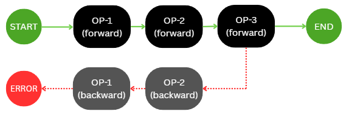
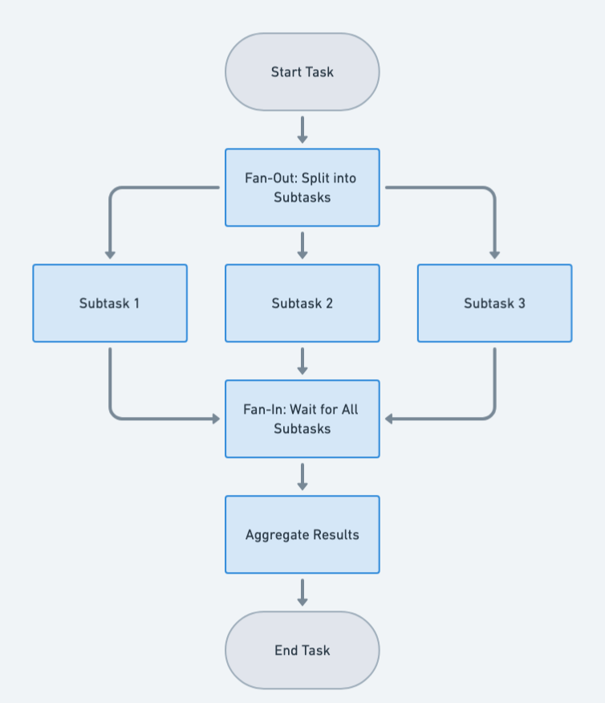

# Design Document: Hybrid Saga Architecture

## Introduction & Problem Statement

In modern distributed systems, operational units rarely follow a single, uniform execution pattern. While transactional
integrity is critical, a strictly sequential workflow often creates unnecessary bottlenecks.

**The Problem:** Traditional architectures force a choice. We either chain operations sequentially (handling
transactions
safely but slowing down parallel enrichments) or fan them out (gaining speed but losing strict rollback guarantees). In
reality, many tasks—such as data enrichment, notification dispatch, or metric logging—need to happen in parallel and
simply support the core transactional components. Furthermore, business logic often relies on "pivots" (conditional
routing) that require dynamically defining multiple distinct processing pipelines.

**The Solution:** The Hybrid Saga Architecture. This approach merges the reliability of the Saga pattern with the
high-throughput capabilities of a parallel fan-out architecture, creating a unified pipeline defined as a "list of
lists."

Real backend operations rarely follow one shape. Most pipelines I've written look like this: a few **critical operations
** that have to succeed together (charge the card, reserve the inventory) interleaved with a swarm of **best-effort
enrichments** (look up the loyalty tier, warm a cache, log to analytics, push a notification). The critical ones need
rollback if anything goes wrong; the enrichments either work or they don't, and the user's request should not fail
because the notification service was slow.

The orchestration tools we usually reach for are designed for one shape or the other. The saga pattern treats every step
as critical and adds rollback semantics to all of them - overkill when half the work is best-effort. A parallel fan-out
runs many tasks at once but has no rollback story - useless if one of those tasks is "charge the customer's card."

So teams hand-roll the mix. `CompletableFuture.allOf(...)` plus a few try/catches plus a `service.undoWhatWeJustDid()`
that drifts every time someone touches it. The rollback discipline, the concurrency primitive, and the
failure-classification rule end up duplicated in every codebase, in subtly-different ways.

**`hybrid-saga` is a small library that names that hand-rolled shape and makes it a first-class, validated, testable
primitive.** A pipeline is a list of steps; each step contains one transactional operation and any number of best-effort
enrichments running alongside it; if the transactional operation fails, the engine rolls back the previously-completed
transactional steps in reverse order. That is the whole idea.

The harder problem this library also addresses: a single application often needs **several** such hybrid pipelines, and
the right one to run depends on some piece of the request (the order type, the customer tier, the feature flag - call
this the **pivot**). The library supports declaring multiple pipelines and picking one per request via that pivot,
without hand-rolled dispatch code.

---

## 2. Terminology & Core Concepts

### 2.0. Glossary

These terms come up throughout the doc. If you've used them in other contexts, the meaning here may be slightly
narrower - read these before assuming.

| Term                            | What it means here                                                                                                                                                                                                                                                                                                                                                       |
|---------------------------------|--------------------------------------------------------------------------------------------------------------------------------------------------------------------------------------------------------------------------------------------------------------------------------------------------------------------------------------------------------------------------|
| **Component**                   | A unit of work - your code. Two flavours: transactional and non-transactional.                                                                                                                                                                                                                                                                                           |
| **Transactional component**     | A component with both a **forward** action and a **compensate** action. Should run sequentially. Any errors during execution will trigger the compensation chain and If a later transactional component fails, the backward action is triggered through `compensate()`. *"Transactional" here means "participates in saga compensation" - NOT an ACID/JDBC transaction.* |
| **Non-transactional component** | A component with only a forward action. May run as fan out parallel executions. Any errors during execution do **not** trigger compensatory actions, and they do not participate in compensation chain as well.                                                                                                                                                          |
| **Step**                        | One unit in the outer sequence of a pipeline. A step contains one **parallel group** of components. System will proceed to next step iff all the components in this step complete successfully.                                                                                                                                                                          |
| **Parallel group**              | The components inside a single step. They run concurrently. The rule: **at most one** transactional component per group; any number of non-transactional.                                                                                                                                                                                                                |
| **Pipeline**                    | A `List<List<Component>>` - outer list is the sequential steps, inner list is the parallel group within each step.                                                                                                                                                                                                                                                       |
| **Pivot**                       | A piece of the master request used to select *which* pipeline to run for this call.                                                                                                                                                                                                                                                                                      |
| **Master request**              | The single input object flowing through every component in a pipeline run.                                                                                                                                                                                                                                                                                               |
| **Context**                     | A per-request, write-once map of *operation name* → *component output*. Components read upstream outputs through it.                                                                                                                                                                                                                                                     |
| **Compensation**                | Invoking previously-completed transactional components' `compensate()` callbacks, in reverse order, after a transactional failure. **Logical rollback** - it does whatever the user wrote in `compensate()`. NOT a DB rollback.                                                                                                                                          |

---

### 2.1. The Saga Pattern

A Saga is a sequence of local transactions (transaction is a unit of work here) where each transaction does certain
configured task/work and proceeds to the next transection in the pipeline/sequence **iff** the current component
completes successfully. If a local transaction fails, the saga executes a series of compensating transactions to undo
the changes made by the preceding operations, in the reverse order.

#### 2.1.1. Properties

| Property                   | Requirement                                                   |
|----------------------------|---------------------------------------------------------------|
| Component per step         | At most one                                                   |
| Service calls or task      | *Exactly one                                                  |
| Mutates System state       | Yes                                                           | 
| Compensation on failure    | Yes                                                           |
| Compensation trigger       | Any failure thrown form the component                         |
| Parallel execution allowed | No                                                            |
| Exception type emitted     | CompensationTriggerException or TransactionalFailureException |

*_internally, the transactional components should make exactly one HTTP service call (if any) or similarly, do only one
unit of work. More simply, each transactional component should do only one sub-task, doing more than one subtask would
kill the saga behavior_

#### 2.1.2. Compensation

#### 2.1.3. Additional Resources

1. ["Saga Pattern Demystified: Orchestration vs Choreography" | ByteByteGo Newsletter](https://blog.bytebytego.com/p/saga-pattern-demystified-orchestration)
2. ["Saga patterns" | AWS](https://docs.aws.amazon.com/prescriptive-guidance/latest/cloud-design-patterns/saga.html)
3. ["Microservices Choreography vs Orchestration" | Solace](https://solace.com/blog/microservices-choreography-vs-orchestration/)
4. ["Choreography vs Orchestration: Two Approaches to the Saga Pattern" | InterviewNoodle](https://interviewnoodle.com/choreography-vs-orchestration-two-approaches-to-the-saga-pattern-8c320a5bc127)
5. ["Comparison of Choreography vs Orchestration Based Saga Patterns in Microservices" | IEEE Xplore](https://ieeexplore.ieee.org/document/9872665)

---

### 2.2. The Fan-out Pattern

The Fan-Out/Fan-In design pattern in Java aims to improve concurrency and optimize processing time by dividing a task
into multiple sub-tasks that can be processed in parallel (fan-out) and then combining the results of these sub-tasks
into a single outcome (fan-in).

#### 2.2.1. Properties

| Property                   | Requirement                      |
|----------------------------|----------------------------------|
| Component per step         | Any                              |
| Service calls or task      | Any                              |
| Mutates System state       | No                               | 
| Compensation on failure    | No                               |
| Compensation trigger       | N/A                              |
| Parallel execution allowed | Yes                              |
| Exception type emitted     | NonTransactionalFailureException |

#### 2.2.2. Fan-out Architecture

#### 2.2.3. Additional Resources

1. ["Mastering the Concurrency — Fan Out Design Pattern" | Medium](https://arshad404.medium.com/s1e5-mastering-the-concurrency-in-go-with-fan-out-design-pattern-ec0c2ac2a0ad)
2. ["Messaging Fanout Pattern for Serverless Architectures Using Amazon SNS" | AWS](https://aws.amazon.com/blogs/compute/messaging-fanout-pattern-for-serverless-architectures-using-amazon-sns/)
3. ["Understanding Fan-Out in System Design" | DEV Community](https://dev.to/nk_sk_6f24fdd730188b284bf/understanding-fan-out-in-system-design-p3c)
4. ["Fan Out" | stream](https://getstream.io/glossary/fan-out/)
5. ["Dagster Data Engineering Glossary: Fan-Out" | Dagster](https://dagster.io/glossary/fan-out)
6. ["Fan-Out Fan-In Pattern in Java: Maximizing Concurrency for Efficient Data Processing" | Java Design Patterns](https://java-design-patterns.com/patterns/fanout-fanin/)

---

### 2.3. The Hybrid Approach

Now, let the saga participating components (aka. transactional components) participate in fan-out architecture, letting
other non-transactional tasks/components to execute parallelly. or say, we can merge both patterns individually - a step
in the pipeline as pure non transactional and other being pure transactional - is also valid. Transaction components
will participate in saga behavior, letting itself being compensated, in case other saga participant has failed. *_see the open item_

#### 2.3.1. open item

**[todo | decision pending]**

if other non transaction task suppose failed after executing 2 transactional components, then also we would need to
initiate the compensation. even though the non-transaction component did noit participate in saga, system sohuld
revert back any rpeviously executed saga components. one of the other approaches would be to make sure once the saga
starts, no other non-transactional components would be allowed. But this would limit the architecture and code desig